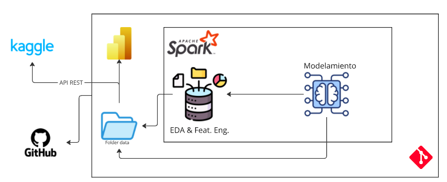

# Solución prueba técnica

por: Cristian Hidalgo

En el presente documento se explica la resolución de la prueba solicitada por Bancolombia. Se abordó el problema de segmentación de clientes para la prevención de lavado de activos y financiamiento del terrorismo. Se presentará el proceso seguido para resolver la prueba, el detalle de todas las etapas, técnicas, hallazgos y supuestos que se tuvieron en cuenta para solucionar la prueba. Se presentarán los códigos documentados que respaldan el ejercicio analítico, la presentación de los resultados de la segmentación y el blueprint o arquitectura de la solución.

## 1. Introducción

Bancolombia como entidad regulada y vigilada debe prevenir que sea utilizada para el lavado de activos o para canalizar recursos hacia actividades terroristas. El regulador exige que para aplicar medidas de control más efectivas y simplificar la complejidad de tratar con numerosos clientes, se realice un proceso de segmentación para tener diferencias significativas en sus características. Este proceso se debe realizar periódicamente y actualmente tiene alta operatividad, requiriendo una capacidad dedicada al 100% de 2 científicos de datos. En promedio se deben mantener 30 modelos con ejecuciones semestrales.

## 2. Objetivo

Esta prueba analítica tiene como objetivo determinar las capacidades analíticas para desarrollar e implementar modelos. Debe diseñar y construir un modelamiento de segmentación partiendo de la información dada y proponer una solución analítica E2E cumpliendo prácticas de MLOps.
## 4. Solución propuesta

Para abordar el problema de segmentación de clientes, se propone la siguiente solución:

1. **Preprocesamiento de los datos**: Se realizó un preprocesamiento de los datos para limpiarlos y prepararlos para el análisis y modelamiento.
2. **Análisis exploratorio de los datos**: Se realizó un análisis exploratorio de los datos para comprender la naturaleza de los datos y detectar posibles patrones.
3. **Feature engineering**: Se realizó un proceso de ingeniería de características para crear nuevas variables que puedan ser útiles para el modelamiento.
4. **Modelamiento de segmentación**: Se aplicaron técnicas de clustering para segmentar a los clientes en grupos homogéneos.
5. **Evaluación de los clusters**: Se evaluó la calidad de los clusters obtenidos.
6. **Presentación de resultados**: Se presentaron los resultados obtenidos en un formato adecuado.
7. **Blueprint de la solución**: Se presentó un blueprint o arquitectura de la solución propuesta.

## 5. Desarrollo

### 5.1 Preprocesamiento de los datos

En esta etapa se realizó un preprocesamiento de los datos para limpiarlos y prepararlos para el análisis exploratorio.
Se trataron las varaiables categóricas teniendo en cuenta la frecuencua de sus niveles, se pasaron a minúsculas para homogeneizar la información.
Se utilizó el framework de spark para el procesamiento de los datos ya que por su volumen, facilita el procesamiento de los mismos.

### 5.2 Análisis exploratorio de los datos

Se realizó un análisis exploratorio de los datos para comprender la naturaleza de los datos y detectar posibles patrones.
Se analizaron las variables numéricas y categóricas a través de un entendimiento de su proporción, para las variables numércias se utilizó una descripción de los principales estadísticos. Al ser datos financieros, se observa una distribución asimétrica con sesgo a la derecha, algo normal para este tipo de datos.
Se encontró que el conjunto de datos estaba compuesto por dos partes, una parte de características de clientes (un millón de clientes) y una parte transaccional (cinco millones de transacciones).  Para la parte transaccional, se utilizó un análisis de las mismas, monto de transacciones promedio, cantidad, etc., se construyó un perfil transaccional de los clientes.

### 5.3 Feature engineering

Se realizó un proceso de ingeniería de características para crear nuevas variables que puedan ser útiles para el modelamiento. Para las variables categóricas, se hizo una dummización teniendo en cuenta que la frecuencia de los niveles fuera superior al 5%, para variables como la ocupación o profesión, se realizó un agrupamiento para obtener menos categorías, como se muestra a continuación:

```python
OCCUPATION_CATEGORIES = {
    "Professionals": ["profesional independiente", "socio o empleado - socio"],
    "Self-employed": ["independiente", "comerciante", "rentista de capital", "agricultor", "ganadero"],
    "Non-working": ["pensionado", "ama de casa", "estudiante", "desempleado con ingresos", "desempleado sin ingresos"],
    "Others": ["None", "otra"]
}

PROFESSION_CATEGORIES = {
    "STEM": [
        "ingenieria de sistemas", "ingenieria industrial", "ingenieria civil",
        "ingenieria mecanica", "ingeniero electronico", "ingenieria electrica",
        "tecnologia sistemas", "ingeniria quimica", "tecnologia electricidad",
        "tecnologia mecanica", "tecnologia industrial", "ingenieria ambiental",
        "ingenieria administrativa", "biologia", "ingenieria de petroleos",
        "tecnologia agropecuaria", "ingenieria agricola", "ingenieria financiera",
        "tecnologia en construccion", "geologia", "ingenieria forestal",
        "ingenieria de minas", "ingenieria sanitaria", "ingeniero metalurgico",
        "tecnologia en minas", "arquitectura", "agronomia"
    ],

    "Health & Medicine": [
        "medicina", "enfermeria", "odontologia", "quimica farmaceutica",
        "nutricion y dietetica", "auxiliar de enfermeria", "regencia de farmacia",
        "auxiliar de odontologia", "operaciones de equipos medicos",
        "tecnologia en ciencias de la salud", "veterinaria", "bacteriologia"
    ],

    "Business, Law & Administration": [
        "administracion", "contaduria", "derecho", "economia",
        "auxiliar contable", "mercadotecnia", "comercio internacional",
        "secretariado", "tecnologia en administracion", "transportador",
        "carrera militar", "pilotos", "azafata"
    ],

    "Arts, Humanities & Social Sciences": [
        "educacion", "psicologia", "comunicacion social", "diseño y publicidad",
        "artes", "trabajo social", "profesores de educacion primaria",
        "profesores de educacion preescolar", "sociologia", "filosofia y letras",
        "deportistas entrenadores tecnicos deport", "musicos artistas empresarios y prud espect",
        "escritores periodistas y trabajadores simil", "fotografos y operadores de camara cine y tv",
        "escultores pintores fotografos y art simi", "sacerdote", "religiosa"
    ]
}
```

### 5.4 Modelamiento de segmentación

Para el modelamiento, se utilizó un modelo base de KMeans con Spark, sirviendo como referencia para otras técnicas de segmentación. Inicialmente, se comenzó la segmentación con 59 variables. Este primer cluster permitió identificar aquellas variables con mayor variación. Posteriormente, se aplicó un modelo de Random Forest para determinar la importancia de las variables en la segmentación.

Considerando estas dos iteraciones: la primera con un KMeans inicial maximizando el indicador de silueta y la segunda con la importancia de las variables del Random Forest, se ejecutó nuevamente el modelo utilizando KMeans (modelo base) y las K variables más importantes.

## 6. Resultados

En este apartado se explicará el resultado obtenido del análisis de segmentos aplicados a los datos preprocesados mediante las fases anteriores: ETL, EDA y Feature Engineering

### 6.1 Resumen general

Se obtuvo un algoritmo final con las siguientes características:

* **Número de segmentos:** 7
* **Indicador de silueta:** 0.5536

La distribución de los mismos se muestra a continuación:

| cluster | count  | proportion |
|---------|--------|------------|
| 1       | 21557  | 0.021559  |
| 6       | 161715 | 0.161730  |
| 3       | 175891 | 0.175907  |
| 5       | 203630 | 0.203649  |
| 4       | 91123  | 0.091131  |
| 2       | 177236 | 0.177252  |
| 0       | 168755 | 0.168771  |


### 6.2 Segmentos

#### Segmento 1: "Profesionales de la Salud de Alto Ingreso"
- 🏥 Profesionales del sector salud
- 💰 Ingreso más alto (2.475.000)
- 🏦 Usa cuenta de ahorro
- 👥 Predominantemente femenino
- 💼 Otras ocupaciones diversas

#### Segmento 2: "Ahorradores de Ingreso Medio-Alto"
- 💰 Ingreso medio-alto (2.000.000)
- 🏦 Usa cuenta de ahorro
- 👥 No hay predominancia de género
- 💼 Ocupación específica no destacada

#### Segmento 3: "Trabajadores Tradicionales"
- 💰 Ingreso medio (1.160.374)
- 🏦 No usa cuenta de ahorro
- 👥 No hay predominancia de género
- 💼 Ocupación específica definida

#### Segmento 4: "Profesionales Urbanos de Medellín"
- 🌆 Residentes de Medellín
- 💰 Ingreso medio-alto (1.761.000)
- 🏦 Usa cuenta de ahorro
- 💼 Otras ocupaciones diversas

#### Segmento 5: "Hombres Profesionales"
- 👨 Predominantemente masculino
- 💰 Ingreso alto (2.000.000)
- 🏦 Usa cuenta de ahorro
- 💼 Otras ocupaciones diversas

#### Segmento 6: "Trabajadores de Ingreso Básico"
- 💰 Ingreso más bajo (545.000)
- 🏦 No usa cuenta de ahorro
- 💼 Otras ocupaciones diversas
- 👥 No hay predominancia de género

#### Segmento 0: "Hombres Trabajadores de Ingreso Medio-Bajo"
- 👨 Predominantemente masculino
- 💰 Ingreso medio-bajo (936.880)
- 🏦 No usa cuenta de ahorro
- 💼 Otras ocupaciones diversas

## 7. Blueprint

A continuación se detalla el blueprint de la solución y se presenta un diagrama de la solución



### 1. Preparación del Entorno
- 🛠️ Configuración del ambiente Spark
- 📦 Instalación de dependencias necesarias (matplotlib, numpy, pandas, etc.)
- 🔧 Configuración de logs y parámetros iniciales

### 2. Ingesta y Preprocesamiento de Datos
#### 2.1 Carga de Datos
- 📥 Lectura de archivos parquet
- 🔍 Validación inicial de datos

#### 2.2 Limpieza de Datos
- 🧹 Estandarización de nombres de columnas
- ✨ Manejo de valores nulos
- 🔢 Conversión de tipos de datos

#### 2.3 Preparación de Features
- 📊 Identificación de variables numéricas y categóricas
- 🎯 Validación de columnas requeridas
- 🔄 Transformación de variables

### 3. Modelado
#### 3.1 Pipeline de Transformación
- ⚙️ Creación de Vector Assembler
- 📏 Escalado de características (StandardScaler)
- 🔗 Construcción del pipeline de transformación

#### 3.2 Selección de Número de Clusters
- 📈 Evaluación de diferentes números de clusters
- 📊 Cálculo de métricas (Silhouette Score)
- ⚖️ Análisis de proporciones de clusters

#### 3.3 Entrenamiento del Modelo
- 🎯 Implementación de K-means
- 💾 Guardado del modelo
- 🔄 Generación de predicciones

### 4. Selección de Características
#### 4.1 Random Forest para Importancia de Features
- 🌲 Entrenamiento de Random Forest
- 📊 Cálculo de importancia de características
- 🎯 Selección de top features

#### 4.2 Reentrenamiento del Modelo
- 🔄 Actualización con características seleccionadas
- 📈 Evaluación del modelo optimizado
- 💾 Guardado del modelo final

### 5. Visualización y Análisis
#### 5.1 Generación de Gráficos
- 📊 Gráficos de métricas de evaluación
- 📈 Visualización de proporciones de clusters
- 🎨 Gráfico de coordenadas paralelas

#### 5.2 Análisis de Segmentos
- 📋 Resumen estadístico por cluster
- 🔍 Caracterización de segmentos
- 📝 Generación de perfiles de cliente

### 6. Persistencia y Documentación
- 💾 Guardado de modelos y predicciones
- 📄 Generación de reportes
- 📚 Documentación del proceso

### 7. Control de Calidad
- ✅ Validación de resultados
- 🔍 Revisión de métricas
- 🎯 Verificación de coherencia de segmentos

### 8. Entregables Finales
- 📊 Visualizaciones interactivas
- 📑 Perfiles de segmentos
- 📈 Métricas de desempeño
- 📋 Documentación técnica
